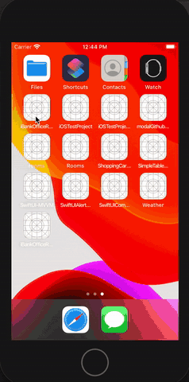

# iBankOfficeRadar

Não coloquei a chave do Google Place. Minha conta do Google Place está com meu cartão de crédito e não posso deixar pública aqui.
Adicionar a chave em GooglePlaceDefinition.swift key

## Enunciado

Opa, blz? Vou te enviar o teste por aqui mesmo, blz?

Desafio - Buscador de Agências

Crie um app que mostre em um mapa as agências em um raio de 20km do ponto centralizado pelo usuário. O mapa deverá estar integrado com a API do google maps. Quando o usuário clicar em uma agência, devem ser exibidos os dados da mesma (endereço, horário de funcionamento, etc...).

Como vc será avaliado?

-Qualidade do código escrito (considerando organização, lógica e arquitetura - se possível utilizar MVVM).
-Implementação de testes unitários e interface
-Crashs do app
-Versionamento do código

Enviar o link para o repositório no github até 23/02 23:59

## Arquitetura 

MVVM arquitetura utilizada

- Network: Camada de acesso a rede
    - GooglePlace: Definições da api do google e chamada
- View: Telas em SwiftUI
- ViewModel: ViewModel da tela do Mapa e Detalhe
- Mode: estrutura Codable do resultado da API do Google

Por falta de tempo fiz uma arquitetura MVVM sem binding / data binding
Gostaria de usar Combine (ou RX)

## Testes

### Unit Test

- Criei apenas 1 teste unitário validando uma chamada mockada
- Em um futuro poderia ser feito mais testes com váriações de erro (200, 400,...). Lista com resultado ou vazia

### UI Test

- Criei apenas 1 teste para validar fluxop de sucesso.
- Em um futuro poderia ser feito mais testes
- Parte de mockar a transação ficou um pouco hardcoded mas a ideia principal de rodar usando dados mockados

## Google Places API

Seguindo Referencia do site do Google 

https://developers.google.com/places/web-service/intro
https://developers.google.com/places/web-service/search

Não coloquei a chave do Google Place. Agora o Google pede que adicionei um cartão de crédito. Então não vou deixar publico a chave
Adicionar a chave em GooglePlaceDefinition.swift key

## Map View + SwiftUI

SwiftUI ainda não tem uma implementação do MapView. Usei esse projeto como referencia

https://github.com/thomas-sivilay/mapview-swiftui

Por falta de tempo desabilitei o zoom do mapa.

## Gerador Modelo

https://app.quicktype.io/ 

Utilizei esse site para converter o JSON em struc em swift

## Improvements

### GPS

- Por falta de tempo deixei a inicialização em um ponto fixo. Poderia ser pela localização do GPS
- Botão para ir para localiozação atual

### Status - Loading/Erro

- Utiliei o label na barra de navegação. Com mais tempo daria para fazer algo mais robusto
